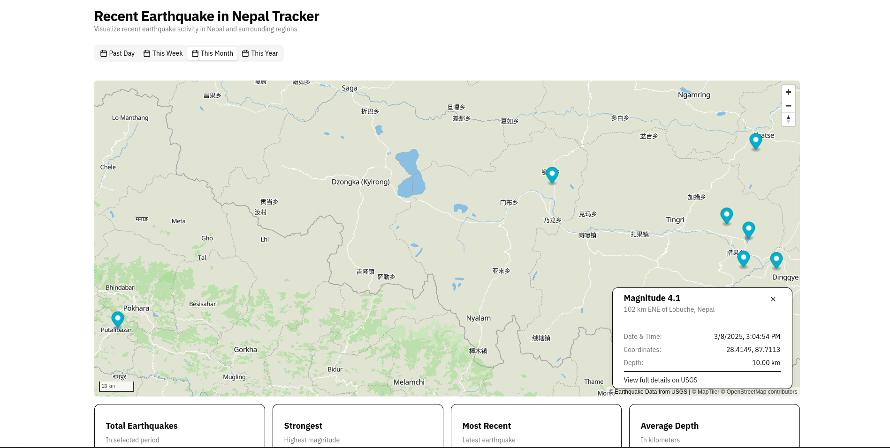

# Recent Earthquake in Nepal Tracker



A real-time earthquake monitoring application focused on Nepal, visualizing seismic activity with interactive maps and detailed information.

- [View Live Demo](https://recent-earthquake-nepal.vercel.app/)

## Features

- 🗺️ Interactive map with earthquake locations
- 🔴 Magnitude-based visualization (size and color)
- 📅 Filter earthquakes by time period (day, week, month, year)
- ℹ️ Detailed earthquake information popups
- 📊 Statistics dashboard showing:
  - Total earthquakes
  - Strongest magnitude
  - Most recent event
  - Average depth

## Technologies Used

- 
- 
- 
- 
- 
- 

## Installation

1. Clone the repository:
   ```bash
   git clone https://github.com/yourusername/nepal-earthquake-tracker.git
   cd nepal-earthquake-tracker
   ```

2. Install dependencies:
   ```bash
   npm install
   ```

3. Create a .env file:
   ```bash
   VITE_MAPTILER_API_KEY=your_maptiler_key_here
   ```

4. Run the development server:
   ```bash
   npm run dev
   ```

## API Usage

This project uses the USGS Earthquake API with the following parameters:
 ```bash
   `https://earthquake.usgs.gov/fdsnws/event/1/query?format=geojson&starttime=${date}&minlatitude=26&maxlatitude=30&minlongitude=80&maxlongitude=89`
   ```

## Project Structure

```bash
src/
├── components/
│   ├── EarthquakeDetails.tsx  # Earthquake info card
│   ├── EarthquakeMap.tsx      # Main component
│   ├── FilterTabs.tsx         # Time period filters
│   ├── Footer.tsx             # App footer
│   ├── MapComponent.tsx       # Map visualization
│   ├── StatisticsCards.tsx    # Stats dashboard
│   └── popup-content.ts       # Map popup generator
├── types/
│   └── earthquake.ts          # Type definitions
├── App.tsx
├── main.tsx
└── styles.css
```

## Contributing
- Fork the project

- Create your feature branch (git checkout -b feature/AmazingFeature)

- Commit your changes (git commit -m 'Add some amazing feature')

- Push to the branch (git push origin feature/AmazingFeature)

- Open a Pull Request

## License
Distributed under the MIT License. See LICENSE for more information.

## Acknowledgements
Data provided by USGS Earthquake Hazards Program

Map tiles by MapTiler

Icons by Lucide